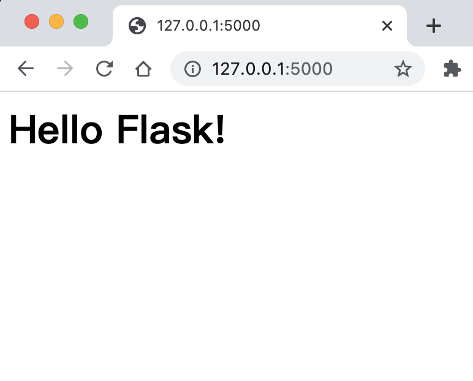
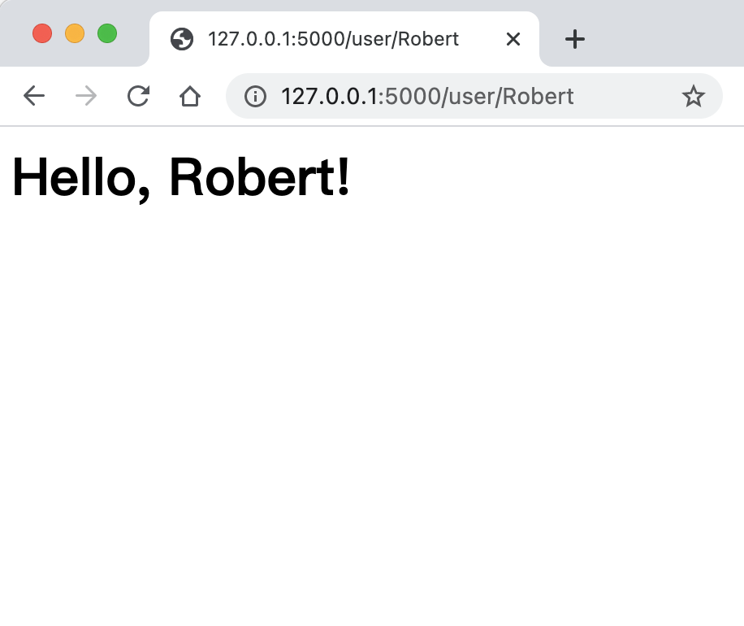
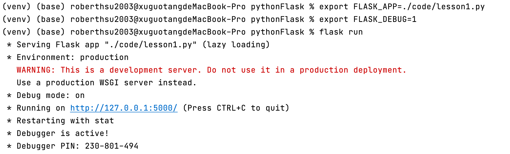

# 基本應用程式架構
## 初始化應用程式

```python
from flask import Flask
app = Flask(__name__)
```

## 規畫路徑

```python
from flask import Flask
app = Flask(__name__)


@app.route('/')
def index():
    return '<h1>Hello Flask! </h1>'
```

## 規畫動態路徑

```python
@app.route('/user/<name>')
def user(name):
	return '<h1>Hello, {}!</h1>'.format(name)
```

## 啟動應用程式

```
#macOS,Linux
$ export FLASK_APP=lesson1.py 
$ flask run

結果:==========================
 * Serving Flask app "./code/lesson1.py"
 * Environment: production
   WARNING: This is a development server. Do not use it in a production deployment.
   Use a production WSGI server instead.
 * Debug mode: off
 * Running on http://127.0.0.1:5000/ (Press CTRL+C to quit)

```

```
#windows
$ set FLASK_APP=lesson1.py 
$ flask run

結果:=============================
 * Serving Flask app "./code/lesson1.py"
 * Environment: production
   WARNING: This is a development server. Do not use it in a production deployment.
   Use a production WSGI server instead.
 * Debug mode: off
 * Running on http://127.0.0.1:5000/ (Press CTRL+C to quit)

```

### 檢視首頁



### 檢視動態路徑




### Debug 模式

Flask應用程式可以選擇開啟Debug模式和reloader模式。

reloader模式是在任何的網站的任何內容有被更改並儲存時，Flash會立即重新啟動，保持最新的狀態。

debug 模式是一個網頁工具，有程式有錯誤，直接顯示於網頁上。

開啟debug模式:FLASK_DEBUG=1




