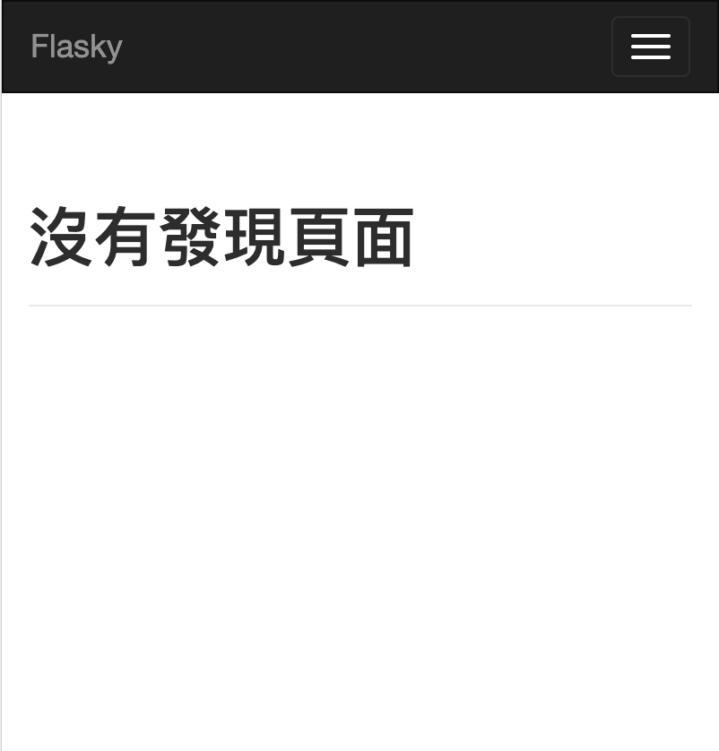
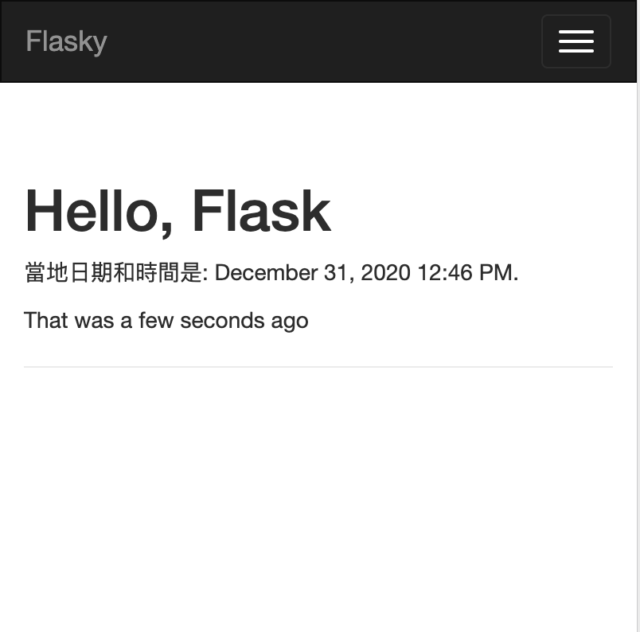

# 網頁樣板
## Jinja2 Template 引擎
樣板必需被建立在templates目錄

1.建立templates/index.html  

```html
<!DOCTYPE html>
<html lang="en">
<head>
    <meta charset="UTF-8">
    <title>Hello! World!</title>
</head>
<body>
<h1>Hello World!</h1>
</body>
</html>
```

2.建立templates/user.html 

```html
<!DOCTYPE html>
<html lang="en">
<head>
    <meta charset="UTF-8">
    <title>Title</title>
</head>
<body>
<h1>Hello, {{ name }}!</h1>
</body>
</html>
```

3.產生樣板

Flask 提供 render_template() function,以整合janja2樣板引擎。render_template()有2個參數，第一個必需是樣板的檔案名，第2個以後必需是一對的組合，使用方式為引數名稱=值，引數名稱將會成為樣板檔案中的變數，以這個範例，name引數名稱將會為user.html內的name變數。

```python
from flask import Flask, render_template

app = Flask(__name__)


@app.route('/')
def index():
    return render_template('index.html')


@app.route('/user/<name>')
def user(name):
    return render_template('user.html',name=name)
```

## 變數

- 語法:{{ name }}

代表在該位置上使用變數的值。

Jinja2 的變數可以使用非常多不同的資料型態，下方為使用不同資料類型的使用方法

```
<p>使用Dictionary的值: {{ mydict['key'] }}.</p>
<p>使用list的值: {{ mylist[3] }}.</p>
<p>使用變數當作list的索引: {{ mylist[myintvar] }}.</p>
<p>使用物件內的方法: {{ myobj.somemethod() }}.</p>
```

變數的值可以修飾，稱為變數的filter  

語法: Hello, {{ name|capitalize}}

### Jinja2 變數的filters

| filters名稱 | 說明 |
|:--|:--|
| safe | 不使用escaping,預設全部使用esacping |
| capitalize | 第一個字元為大寫，其餘的為小寫 |
| lower | 全部為小寫 |
| upper | 全部為大寫 |
| title | 每個英文字的第一個字是大寫 |
| trim | 清除文字前面和後面的空白 |
| striptags | 清除變數值內的html標籤 |

使用safe filter,則變數內容如果是`<h1>Hello</h1>`將變成`&lt;h1&gt;Hello&lt;/h1&gt;`
> 注意
>
表單的輸入不要使用safe

## 判斷架構

語法:

```

	Hello,{{ user }}!

	Hello, Stranger!

```

## 迴圈架構

語法:

```
<ul>
	
	<li>{{ comment }}</li>
	
</u>
```

### Jinja2支援巨集(Marcos)

語法:

```
 
		<li>{{ comment }}</li>


<ul>
	
     {{ render_comment(comment) }}
	
</ul>
```

巨集可以單獨儲存在一個html檔案內，下方的範例是marcos初儲存macros.html檔案內,使用import載入

```

<ul>
    
	    {{ macros.render_comment(comment) }}
		
</ul>
```

### include

網頁可以使用組合的方式建立，部份會重覆使用的程式碼可以放在單獨的html檔案內，要使用時，使用include語法載入

```

```

### 繼承

先建立一個base樣版

```
<html>
    <head>
			
				<title> - My Application</title> 
			
    </head>
    <body>
        
        
    </body>
</html>
```

Base樣板內使用block語法，建立可以在衍生樣板內進行覆寫的區域，在上面的範例中，建立3個block,一個為head block ,title block, 一個為body block。 title block 在 head block內。

使用語法extends繼承base樣板，語法如下

```

Index

	{{ super() }}
	<style>
	</style>


 
	<h1>Hello, World!</h1> 

```

## Bootstrap 整合

```
$ pip install flask-bootstrap
```

### 使用FlasK-Bootstrap範例,修改py檔

```python
from flask import Flask, render_template
from flask_bootstrap import Bootstrap

app = Flask(__name__)
bootstrap = Bootstrap(app)


@app.route('/')
def index():
    return render_template('index.html')


@app.route('/user/<name>')
def user(name):
    return render_template('user.html',name=name)
```

### 使用Flash-Bootstrap範例,修改templates/user.html

```

Flasky

<div class="navbar navbar-inverse" role="navigation">
    <div class="container">
        <div class="navbar-header">
            <button type="button" class="navbar-toggle"
                    data-toggle="collapse" data-target=".navbar-collapse">
                <span class="sr-only">Toggle navigation</span>
                <span class="icon-bar"></span>
                <span class="icon-bar"></span>
                <span class="icon-bar"></span>
            </button>
            <a class="navbar-brand" href="/">Flasky</a>
        </div>
        <div class="navbar-collapse collapse">
            <ul class="nav navbar-nav">
                <li><a href="/">Home</a></li>
            </ul>
        </div>
    </div>
</div>


<div class="container">
    <div class="page-header">
        <h1>Hello, {{ name }}!</h1>
    </div>
</div>

```


### Flask-Bootstraps 基本的blocks

| block名稱 | 外部Block |
|:--|:--|
| doc |  |
| html | doc |
| html_attribs | doc |
| head | doc |
| body | doc |
| body_attribs | body |
| title | head |
| styles | head |
| metas | head |
| navbar | body |
| content | body |
| scripts | body |

### 增加自訂的css

```

{{super()}}
<link rel="stylesheet"
      href="{{url_for('.static', filename='mystyle.css')}}">

```

### 增加自訂的javascript

```

<script src="{{url_for('.static', filename='myscripts.js')}}"></script>
{{super()}}

```

### 增加html標籤屬性

```
 lang="en"
```

## 自訂404,500錯誤頁面

- 404:不存在的頁面,不存在的路徑
- 500:應用程式無法處理的錯誤

```python
@app.errorhandler(404) 
def page_not_found(e):
	return render_template('404.html'), 404
	
@app.errorhandler(500)
def internal_server_error(e):
	return render_template('500.html'), 500
```

就像view function一樣，但是return是一組tuple，tuple最後的內容是一個整數，這整數必需是錯誤的代碼。

404.html和500.html非常相似，由其是上方的導覽列是一致的，此時可以利用jinja2的繼承功能，先建立`templates/base.html`，此頁面繼承`bootstrap/base.html`頁面，此時`templates/base.html`就有bootstrape的功能，並在`templates/base.html`內加入相同部份的內容，`505.html`和`400.html`再繼承`templates/base.html`,並各自加入不同的內容。

下方範例:templates/base.html

```

Robert


<div class="navbar navbar-inverse" role="navigation">
    <div class="container">
        <div class="navbar-header">
            <button type="button" class="navbar-toggle" data-toggle="collapse" data-target=".navbar-collapse">
                <span class="sr-only">Toggle navigation</span>
                <span class="icon-bar"></span>
                <span class="icon-bar"></span>
                <span class="icon-bar"></span>
            </button>
            <a class="navbar-brand" href="/">Flasky</a>
        </div>
        <div class="navbar-collapse collapse">
            <ul class="nav navbar-nav">
                <li><a href="/">Home</a></li>
            </ul>
        </div>
    </div>
</div>




<div class="container">
    
</div>

```

下方範例:templates/404.html

```

Robert - Page Not Found

<div class="page-header">
    <h1>沒有發現頁面</h1>
</div>

```



下方範例:templates/500.html

```

Robert 應用程式無法處理

<div class="page-header">
    <h1>應用程式無法處理</h1>
</div>

```

下方範例:更改templates/user.html

```

Robert

<div class="page-header">
    <h1>Hello, {{name}}</h1>
</div>

```

## Links

建立動態的url連結，使用url_for()function，將可以利用應用程式內的資料，使用程式碼的方式建立動態連結。

url_for()內第一個參數使用view function的名稱，但必需是字串類型。以此範例如果是url_for('index'), 則會傳出相對路徑 "/"，如果使用url_for('index', external=True), 則會傳出絕對路徑 "http://localhost:5000/"

以`def user(name):`必需動態方式傳入name,此時參數就必需加上引數名稱name=value,例如`url_for('user', name='robert' _external=True)`, 傳出的路徑是`http://localhost:5000/user/john`

如果使用url_for('user', name='john', page=2, version=1),將會傳出`/user/john?page=2&version=1`

## 靜態網頁

網頁不僅是使用python和樣板建立，許多時候需要使用images, javsScript, css的檔案。

`static`關鍵字將參考到static目錄，例如使用url_for('static', filename='css/style.css', _external=True)將會傳出http://localhost:5000/static/css/style.css

在預設的Flask，會將根目錄內的static子目錄，當作是存放靜態檔案的預設位置。

下面範例將會使用static目錄內的favicon.ico，修改templates/base.html

```

    {{ super() }}
    <link rel="shortcut icon" href="{{ url_for('static', filename='favicon.ico') }}" type="image/x-icon">
    <link rel="icon" href="{{ url_for('static', filename='favicon.ico') }}" type="image/x-icon">

```

注意:{{super()}}的意思就是將父base的內容保留，並放在這個位置，並在下面增加新增的內容，也可以說寫了{{super()}}，就不會覆蓋上層block內的內容

## 本地日期和時間
解決顯示當地使用者的日期和時間是有一點小複雜，一般解決的方式是使用javascript的程式碼，這也是最好的解決方式。

有一個javascript的資源庫`Moment.js`,可以很方便的解決當地日期和時間是問題。Flask也有這個javascript的套件，但必需要安裝在server端內。

```
$ pip install flask-moment
```

在py檔內加上

```python
from flask_moment import Moment
moment = Moment(app)
```

```python
from flask import Flask, render_template
from flask_bootstrap import Bootstrap
from flask_moment import Moment


app = Flask(__name__)
bootstrap = Bootstrap(app)
moment = Moment(app)

@app.route('/')
def index():
    return render_template('index.html')


@app.route('/user/<name>')
def user(name):
    return render_template('user.html',name=name)

@app.errorhandler(404)
def page_not_found(e):
    return render_template('404.html'), 404

@app.errorhandler(500)
def internal_server_error(e):
    return render_template('500.html'), 500
```

Flask-Moment是使用Jquery.js的程式庫，所以我們的程式碼必需要有jquery.js的程式庫，由於我們已經有使用Bootstrap的套件，此套件內就已經有包含jquery.js。

在templates/base.html內載入Moment.js程式庫

```

{{ super() }}
{{ moment.include_moment() }}

```

```


    {{ super() }}
    <link rel="shortcut icon" href="{{ url_for('static', filename='favicon.ico') }}" type="image/x-icon">
    <link rel="icon" href="{{ url_for('static', filename='favicon.ico') }}" type="image/x-icon">

Robert


<div class="navbar navbar-inverse" role="navigation">
    <div class="container">
        <div class="navbar-header">
            <button type="button" class="navbar-toggle" data-toggle="collapse" data-target=".navbar-collapse">
                <span class="sr-only">Toggle navigation</span>
                <span class="icon-bar"></span>
                <span class="icon-bar"></span>
                <span class="icon-bar"></span>
            </button>
            <a class="navbar-brand" href="/">Flasky</a>
        </div>
        <div class="navbar-collapse collapse">
            <ul class="nav navbar-nav">
                <li><a href="/">Home</a></li>
            </ul>
        </div>
    </div>
</div>




<div class="container">
    
</div>



{{ super() }}
{{ moment.include_moment() }}

```

在py檔內，必需將時間傳給view function

```python
from datatime import datetime
@app.route('/')
def index():
	return render_template('index.html', current_time=datetime.utcnow())
```

```python
from flask import Flask, render_template
from flask_bootstrap import Bootstrap
from flask_moment import Moment
from datetime import datetime


app = Flask(__name__)
bootstrap = Bootstrap(app)
moment = Moment(app)

@app.route('/')
def index():
    return render_template('index.html', current_time=datetime.utcnow())


@app.route('/user/<name>')
def user(name):
    return render_template('user.html',name=name)

@app.errorhandler(404)
def page_not_found(e):
    return render_template('404.html'), 404

@app.errorhandler(500)
def internal_server_error(e):
    return render_template('500.html'), 500
```

templates/index.html使用Flask-Moment

```html
<p>當地日期和時間是: {{ moment(current_time).format('LLL') }}.</p>
<p>That was {{ moment(current_time).fromNow(refresh=True) }}</p>
```

```

Robert

<div class="page-header">
    <h1>Hello, Flask</h1>
    <p>當地日期和時間是: {{ moment(current_time).format('LLL') }}.</p>
    <p>That was {{ moment(current_time).fromNow(refresh=True) }}</p>
</div>

```




