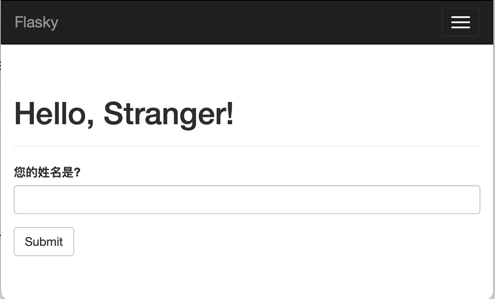
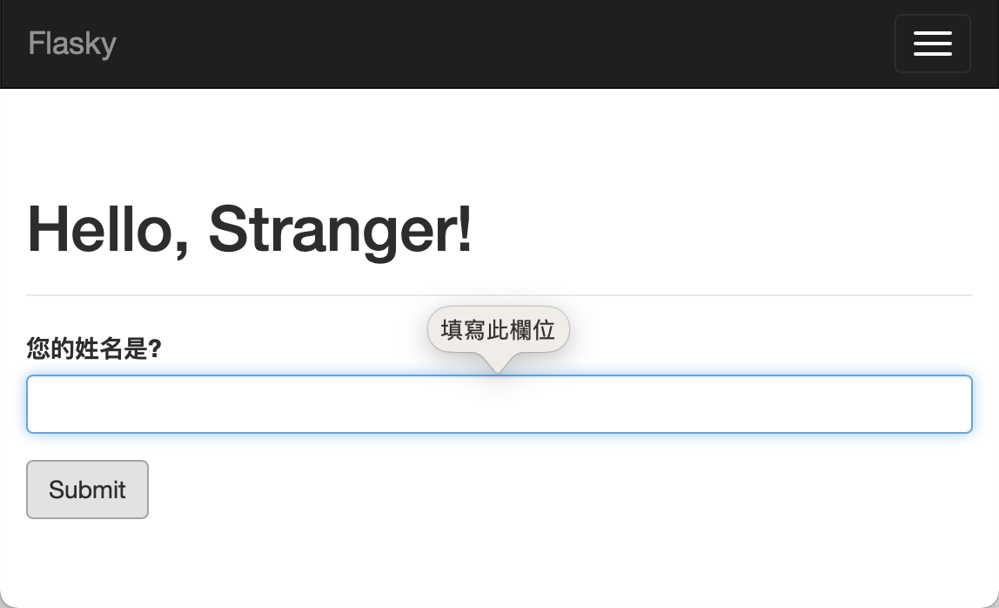
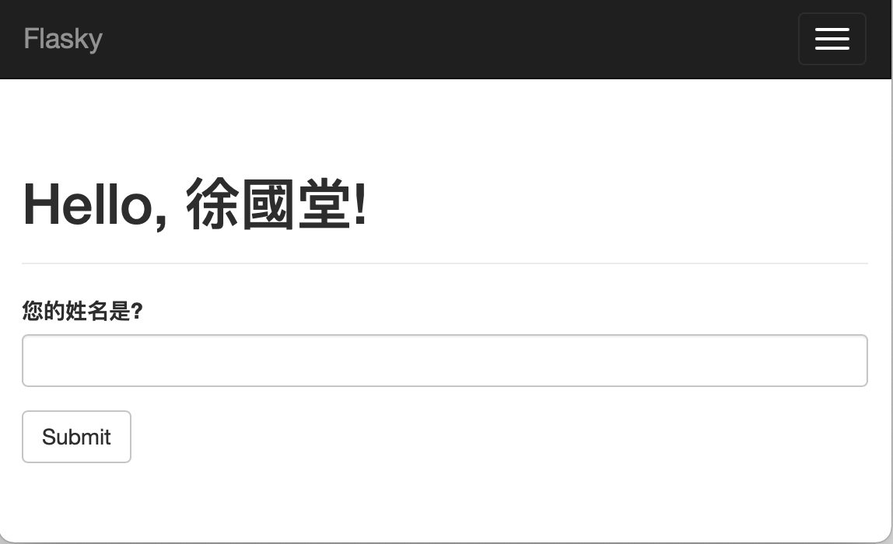

# 網頁表單


網頁樣版和網頁表單的運作方式剛好相反，前者是呈現資訊給使用者，後者是使用者將資訊傳送給伺服器。網頁表單將來探討由使用者網頁傳送到使用者端的流程和處理方式。

建立網頁表單，可以讓使用都輸入資訊並提交給伺服器，大部份使用表單提交的方式是使用POST request, 所有向伺服器提出的需求全部都是儲存於request物件內，如果是POST request,透過request.form可以取出所有提交資料。

FLask-WTF套件的工作，就是建立HTML表單和驗證使用者輸入的資訊。

- 安裝Flask-WTF套件

```
(venv) $ pip install flask-wtf
```

## 防範(CSRF攻擊)
CSRF是一種常見的網路攻擊手法，全名是 Cross Site Request Forgery( 跨站請求偽造)，接下來我們就來介紹一下這種攻擊手法。
我們知道大部分的網站應用都是採用cookie或session的方式進行登入驗證，當通過登入驗證之後，網站就會給你一個通行證存在cookie或seesion中，代表之後的動作中都不需要重複驗證身分了。這當然是一個好事，沒有人能接受做每一件事都要再輸入一次帳號密碼，但CSRF的攻擊正是鑽了這個機制的漏洞來達到攻擊的目的!

我們可以想像cookies就像是每個人身上的筆記本，當你在A銀行登入之後，A銀行在你的筆記本上蓋了個印章，有這個印章之後，接下來三個小時內你的所有動作都不需要重複驗證身分。但你在這三小時內又跑去逛了其他網頁，很不巧的就逛到了駭客B架設的惡意網頁，這個惡意網頁偷偷複製了你的cookie筆記本的印章，跑去打A銀行的轉帳API，請A銀行把你的存款匯10萬元到駭客B自己的帳戶，由於A銀行認印章不認人，所以就接受了這筆匯款請求。
所以無辜的你，只是登入了A銀行的帳戶，同時逛逛網拍、找找資料，突然間就損失了10萬塊! 這就是CSRF可怕的地方。

[參考CSRF攻擊文案](https://medium.com/@Tommmmm/csrf-攻擊原理-d0f2a51810ca)

## 設定環境

不像其它的套件，Flask-WTF不需要在應用程式階段初始化，但它需要一個secret key, 這個secret key是一串自定的字串，這字串的目的是保護使用者資料的安全性和完整性。

設定方式如下:

```python
app = Flask(__name__)
app.config['SECRET_KEY'] = '不好猜的文字'
```


app.config是個dictionary，目的是為了儲存整個app的設定，更改內容來達到設定整個網站的目的。

secret key是為了預防偽造的request(cross-site request forgery(CSRF))攻擊，Flask-WTF會為所有HTML表單產生安全的憑證，並且儲存在使用者的session內，要產生安全憑證，必需利用secret key。所以只要有使用flask-WTF就必需在應用程式內設定secret key

這個環境調整變數也可以儲存成為檔案，利用專用的方法將設定檔載入

> 注意:

> secret_key標準和安全的方式是儲存在環境變數內，而不是放在程式碼中，後面將會討論


## Form 類別
使用Flask-WTF, 每一個web form的形成是透過一個繼承於FlaskForm的類別。所以要使用WTF的表單功能，就必需要自訂一個繼承於FLaskForm的類別，這個類別內定義所有表單所需要的表單欄位，每一個欄位都有各自的對應物件，每一個欄位都有一個validator參數,這個參數的值必需是一個list,list內要放所需要的function，function是用來驗證使用者輸入的內容是否合法。

建立一個繼承於FlaskForm的NameForm類別，並加入文字欄位和傳出按鈕

```
from flask_wtf import FlaskForm
from wtforms import StringField,SubmitField
from wtforms.validators import DataRequired

class NameForm(FlaskForm):
    name = StringField("您的姓名是?", validators=[DataRequired()])
    submit = SubmitField('Submit')
```

name和submit是類別屬性

DataRequired()是檢查使用者在這欄位上必需要填入任何值，不可以是空的。

以下表單是WTForms 對應標準的HTML欄位 

| 欄位類型 | 說明 |
|:--|:--|
| BooleanField | 檢查欄位只接受True和False值 |
| DateField | 文字日期欄位，使用特定格式，接受datetime.date值 |
| DateTimeField | 文字日期時間欄位，使用特定格式，接受datetime.datetime值 |
| DecimalField | 文字欄位接受decimal.Decimal值 |
| FileField | 檔案上傳欄位 |
| HiddenField | 隱藏文字欄位 |
| MultipleFileField | 多個檔案上傳欄位 |
| FieldList | 一組列表的特定格式欄位 |
| FloatField | 文字欄位接受浮點數值 |
| FormField | 表單欄位，放在父表單內 |
| Integer | 文字欄位接受整數數值 |
| PasswordField | 密碼欄位 |
| RadioField | 一組單選鈕 |
| SelectField | 下接式表單 |
| SelectMultipleField | 下接式表單和多選功能 |
| SubmitField | 表單送出資料鈕 |
| StringField | 輸入單行字串欄位 |
| TextAreaField | 多行文字欄位 |

以上是WTForms 的驗證功能

| 驗證功能 | 說明 |
|:--|:--|
| DataRequired | 必需要有資料, 送出時驗證 |
| Email | 驗證email的格式 |
| EqualTo | 比較2個欄位的輸入內容必需相等，用在類似密碼輸入2次 |
| InputRequired | 必需要有資料, 未送出時驗證 |
| IPAddress | IPv4網址驗證 |
| Length | 字串長度的驗證 |
| MacAddress | MAC網址的驗證 |
| NumberRange | 數值範圍的驗證 |
| Optional | 允許欄位為空值 |
| Regexp | 允許自訂文字正規則格式驗證 |
| URL | 驗證網址的格式 |
| UUID | 驗證身份証的格式 |
| AnyOf | 驗證在一組值內，必需有其中一個值 |
| NoneOf | 驗證在一組值內，必需輸入值沒有一個包含在這一組值內|

## 產生HTML的表單

透過viewFunction,傳遞NameForm的實體給樣板，樣板接收到NameForm後，取出類別屬性(就是取出欄位實體)

以下是在樣板內，使用NameForm實體form,取出欄位實體

```
<form method="POST">
	{{ form.hidden_tag() }}
	{{ form.name.label }} {{ form.name() }}
	{{ form.submit() }}
</form>
```

> 注意:
>
> form.hidden_tag()，會產生額外的隱藏欄位，這個隱藏欄位是為了預防CSRF(Cross Site Request Forgery)的詐騙行為

在產生表單欄位時，可以加入一些額外的引數，來增加我們的Html的元素的屬性，例如id,class，以便給javascript或css使用

```
<form method="POST">
	{{ form.hidden_tag() }}
	{{ form.name.label }} {{ form.name(id='my-text-field') }}
	{{ form.submit() }}
</form>
```

使用Flask-Bootstrap樣板, Flask-Bootstrap也有支援Flask-WTF，使用Flask_Bootstrap的quick_form()建立支援Flask_WTF的Bootstrap表單。

```

{{ wtf.quick_form(form) }}
```

下面是完整的網頁頁面
```

 Flask_Robert 

<div class="page-header">
 <h1>Hello, {{name}}Stranger!</h1>
</div>
{{wtf.quick_form(form)}}

```

## View Function處理表單

```python
from hello import NameForm


app = Flask(__name__)
app.config['SECRET_KEY'] = 'security code'
bootstrap = Bootstrap(app)
moment = Moment(app)

@app.route('/', methods=['GET', 'POST'])
def index():
    name = None
    form = NameForm()
    if form.validate_on_submit():
        name = form.name.data
        form.name.data = ''
    return render_template('index.html', form=form, name=name)


@app.route('/user/<name>')
def user(name):
    return render_template('user.html',name=name)

@app.errorhandler(404)
def page_not_found(e):
    return render_template('404.html'), 404

@app.errorhandler(500)
def internal_server_error(e):
    return render_template('500.html'), 500
    
```

form.validate_on_submit()，如果表單已經送出則傳出True,如果表單尚未傳出，則傳出False

完成畫面



未輸入按Submit



輸入自已姓名並按下Submit


## 重新導向網頁和使用者Session

目前網頁還是會有一些問題，只要是送出後，如果使用重新整理網頁，則會出現網頁的提示框，主要的原因就是因為使用POST request的關係，所以要解決這個問題就是將網頁重新導向這一頁，並且是使用GET的request. 這個決解方式有被稱為Post/Redirect/Get方式。

由於重新導向的問題，name也要傳遞到導向的頁面，解決的方式就是使用Session,而使用者的Session就是將name資訊儲存在瀏覽器內。到達導向頁面後，再使用取出Session內的資料，Session也是以dictionary資訊儲存。

```python
from flask import Flask,render_template,session,redirect,url_for
from flask_bootstrap import Bootstrap
from flask_wtf import FlaskForm
from wtforms import StringField,SubmitField
from wtforms.validators import DataRequired

app = Flask(__name__)
app.config['SECRET_KEY'] = '2uyxdedxgjux8jkKUNkkjwesm'
bootstrap = Bootstrap(app)

class NameForm(FlaskForm):
    name = StringField("請輸入姓名?",validators=[DataRequired()])
    submit = SubmitField("提交")

@app.route('/',methods=['GET','POST'])
def index():
    form = NameForm()
    if form.validate_on_submit():
        session['name'] = form.name.data
        return redirect(url_for('index'))
    return render_template('index1.html',form=form,name=session.get('name'))
```

> 注意:session被取出時必需使用get()的方法，原因是如果使用dictionary取出的語法session['name']，第一次進入時，並沒有name，會產生錯誤，造成程式中斷，但使用get('name')的語法，如果沒有這個name，則只會傳出None。

## 提示訊息

提示訊息是要產生一個提醒使用者的訊息，目前這頁面還有的問題是如果使用者一直更改名字，並重新提交，先前我們已經接收到相同的訊息時，此時必需提示使用者，將程式修改如下:

```
from flask import Flask,render_template,session,redirect,url_for,flash
from flask_bootstrap import Bootstrap
from flask_wtf import FlaskForm
from wtforms import StringField,SubmitField
from wtforms.validators import DataRequired

app = Flask(__name__)
app.config['SECRET_KEY'] = '2uyxdedxgjux8jkKUNkkjwesm'
bootstrap = Bootstrap(app)

class NameForm(FlaskForm):
    name = StringField("請輸入姓名?",validators=[DataRequired()])
    submit = SubmitField("提交")

@app.route('/',methods=['GET','POST'])
def index():
    form = NameForm()
    if form.validate_on_submit():
        old_name = session.get('name')
        if old_name is not None and old_name != form.name.data:
            flash('你已經更改了姓名')
        session['name'] = form.name.data
        return redirect(url_for('index'))
    return render_template('index1.html',form=form,name=session.get('name'))

```

```


 表單網頁 

<nav class="navbar navbar-default">
  <div class="container-fluid">
    <div class="navbar-header">
      <a class="navbar-brand" href="#">
        Brand
      </a>
    </div>
  </div>
</nav>



<div class="container">
    
    <div class="alert alert-warning alert-dismissible" role="alert">
        <button type="button" class="close" data-dismiss="alert" aria-label="Close"><span
                aria-hidden="true">&times;</span></button>
        <strong>Warning!</strong>{{message}}
    </div>

    
    <div class="page-header">
    <h1>Hello,  {{ name }}  Stranger </h1>
    </div>
</div>


{{ wtf.quick_form(form) }}


```