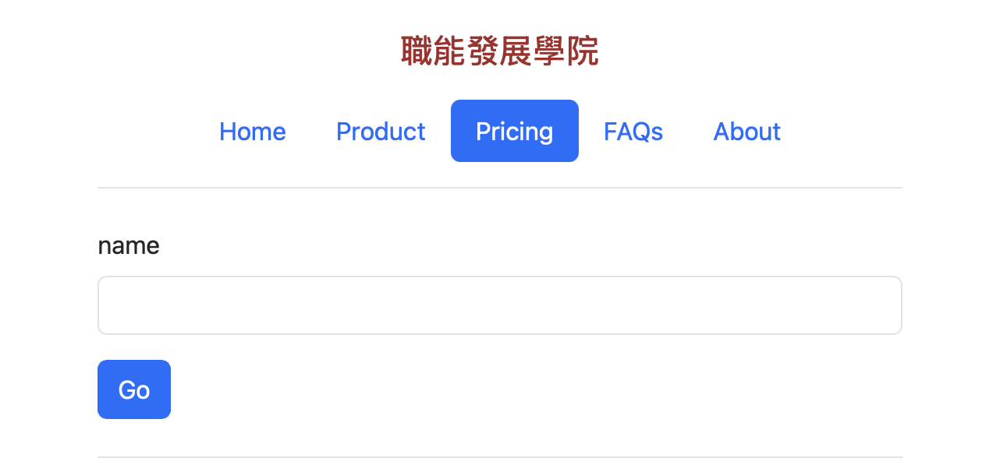
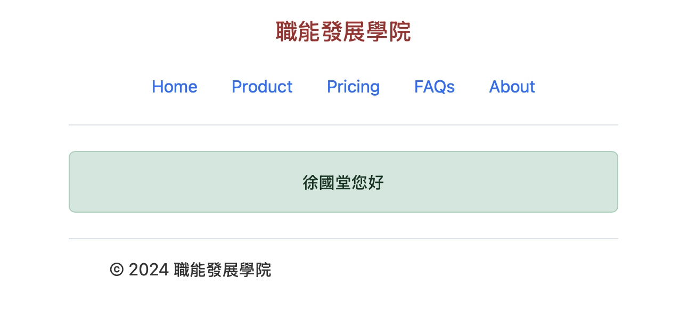

## 最簡單的表單範例

- 參考flask_wtf的官網

**表單**



**成功輸入**



**Flask建立secret key**

```python
import secrets

app = Flask(__name__)
app.config['SECRET_KEY'] = secrets.token_hex(16) 
```

**建立繼承FlaskForm的class**

```python
from flask_wtf import FlaskForm

class MyForm(FlaskForm):
    name = StringField('name',validators=[DataRequired()])
```

**處理@app.route()**
- methos必需要是支援POST
- 建立MyForm實體
- 要有驗証成功的動作(驗証失敗要顯示於原來的網頁)
- 要把表單實體傳送至網頁
- 驗證成功,redirect到成功頁面,並傳送name至成功頁面

```python
@app.route("/pricing", methods=['GET','POST'])
def pricing():
    form = MyForm()
    if form.validate_on_submit():
        name = request.form['name'] 
        return redirect(url_for('success',name=name)) 
    return render_template('pricing.j2',form=form)
```

**實作表單頁面**
- 必需加上驗証錯誤的處理方法
- 套用表單原件套用bootstrap

```python
<form method="POST" action="">
    {{form.csrf_token}}
    {{form.name.label}} {{form.name(size=20)}}
    <input type="submit" value="Go">
</form>

    <ul class="error">
    
        <li>{{ error }}</li>
    

```

**傳送成功的頁面**

**py檔**

```
@app.route("/success")
def success():
    name = request.args.get('name',default="",type=str)
    return render_template('success.j2',name=name) 
```

**成功頁面**
- success.js

```

登入成功畫面

 {{super()}} 


<div class="container">
    <div class="alert alert-success" role="alert">    
    <center>{{name}}您好</center>
    </div>
</div>

```
