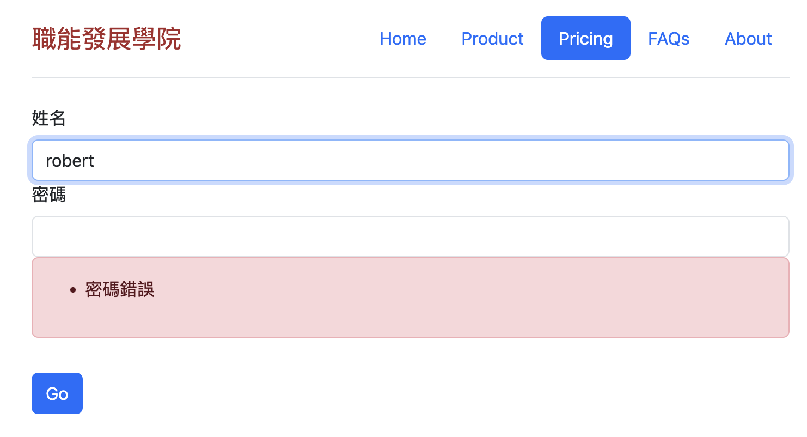

# 登入增加增加密碼step2
- 延續step1
- 建立密碼欄位-限定一定要有值,5~10個字元
- 手動加入錯誤訊息



**py檔(部份)**

```python
from wtforms import StringField,PasswordField

class MyForm(FlaskForm):
    name = StringField('姓名',
                       validators=[DataRequired()])
    password = PasswordField('密碼',
                             validators=[DataRequired(),Length(5,10,message='密碼必需:%(min)~%(max)字元')])
```

**網頁增加欄位(部份)**

```jinja
<form method="POST" action="" class="container">
    {{form.csrf_token}}
    {{form.name.label(class="form-label")}} {{form.name(size=20,class="form-control")}}
    {{form.password.label(class='form-label')}} {{form.password(size=20,class='form-control')}}
    <input type="submit" value="Go" class="btn btn-primary mt-3">
</form>
```

**驗證密碼成功或失敗py**
- 手動增加錯誤->form.password.errors.append("密碼錯誤")

```python
def pricing():
    form = MyForm()
    if form.validate_on_submit():
        name = request.form['name']
        password = request.form['password']
        if password == "12345":
            return redirect(url_for('success',name=name))
        else:
            form.password.errors.append("密碼錯誤")
            
        
    return render_template('pricing.j2',form=form)
```

**錯誤的頁面**

- 套用bootstrap (Alerts)

```jinja
<form method="POST" action="" class="container">
    {{form.csrf_token}}
    {{form.name.label(class="form-label")}} {{form.name(size=20,class="form-control")}}
    
    <div class="alert alert-danger" role="alert">
        <ul class="error">
            
                <li>{{ error }}</li>
            
        </ul>
    </div>
    
    {{form.password.label(class='form-label')}} {{form.password(size=20,class='form-control')}}
   
    <div class="alert alert-danger" role="alert">
        <ul class="error">
            
                <li>{{ error }}</li>
            
        </ul>
    </div>
     
    <input type="submit" value="Go" class="btn btn-primary mt-3">
</form>
```